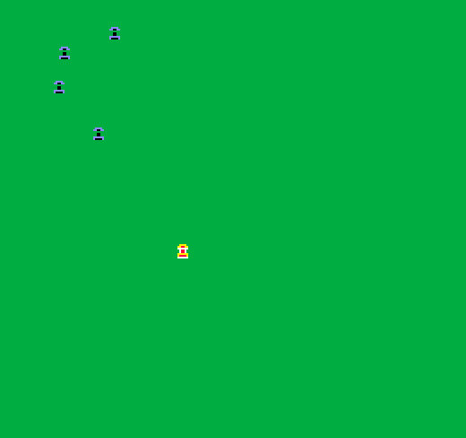

# Road Burner

Author: Pavan Paravasthu

Design: Drive along the road using the arrow keys. Press space to turn on the after burner and destroy your opponents.

Screen Shot:

How Your Asset Pipeline Works:

(TODO: describe the steps in your asset pipeline, from source files to tiles/backgrounds/whatever you upload to the PPU466.)
1. Used GIMP to create an 8x8 car sprite
2. Ran a python script to convert it into the tile pattern arrays

How To Play:

(TODO: describe the controls and (if needed) goals/strategy.)

Sources: (TODO: list a source URL for any assets you did not create yourself. Make sure you have a license for the asset.)

This game was built with [NEST](NEST.md).

